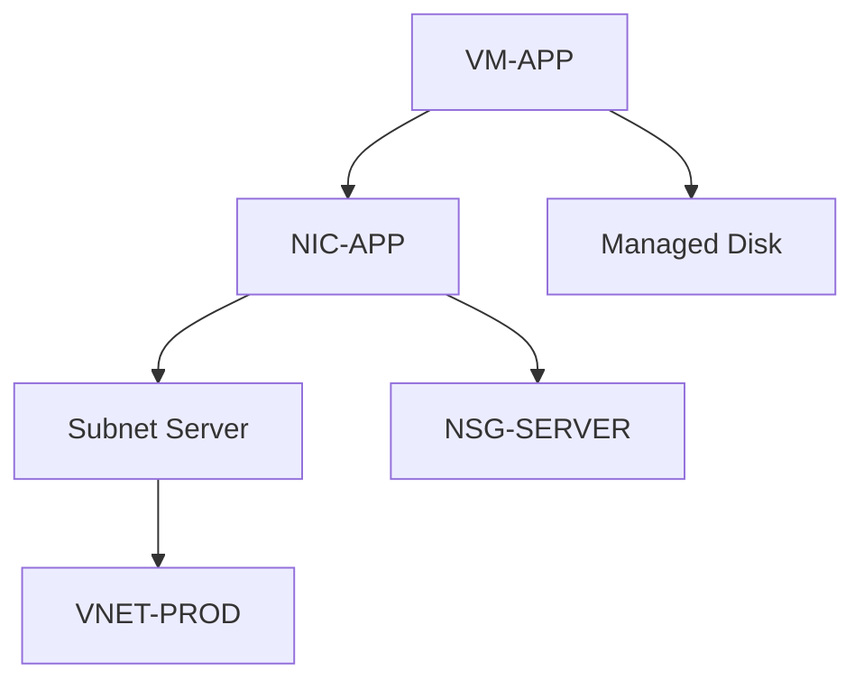

# AzureInfrastructureCollector – Umsetzungsplan

> **Status:** Source of Truth  
> **Repository:** `Vertax1337/AzureInfrastructureCollector`  
> **Default Branch:** `main`  
> **Dokumentstatus:** Verbindlicher Entwicklungsplan  
> **Stand:** 2026-08-10  
> **Initiale Zielversion:** `0.1.0`

---

## 1. Zweck dieses Dokuments

Diese Datei ist die **verbindliche Source of Truth** für die Entwicklung des Projekts **AzureInfrastructureCollector**.

Sie beschreibt:

- Ziel und Zweck des Collectors,
- Architektur und technische Grundentscheidungen,
- unterstützte Betriebsarten,
- zu erfassende Azure-Bereiche,
- Sicherheits- und Datenschutzanforderungen,
- Ausgabeformat und Datenmodell,
- Entwicklungsphasen,
- Abnahmekriterien,
- sowie geplante spätere Erweiterungen.

### 1.1 Verbindlichkeit

Bei Abweichungen zwischen Implementierung, Issue, Chat-Verlauf, README oder sonstiger Dokumentation gilt grundsätzlich dieser Umsetzungsplan.

Änderungen an Architektur, Scope oder technischen Grundentscheidungen sollen **zuerst in dieser Datei dokumentiert** und anschließend implementiert werden.

Das Dokument soll mit dem Projekt fortlaufend versioniert werden und nachvollziehbar machen, warum bestimmte Entscheidungen getroffen wurden.

---

# 2. Projektziel

Der **AzureInfrastructureCollector** soll Azure-Infrastrukturen automatisiert, reproduzierbar und ausschließlich lesend inventarisieren.

Das Werkzeug soll insbesondere für wiederkehrende Kundendokumentationen geeignet sein und darf deshalb **keine kundenspezifischen Annahmen oder fest codierten Tenant-, Subscription-, Resource-Group- oder Ressourcennamen enthalten**.

Der Collector soll eine Azure-Umgebung in ein strukturiertes, maschinenlesbares Exportformat überführen, das anschließend als Grundlage für:

- technische Bestandsdokumentationen,
- Architekturdiagramme,
- KI-gestützte Dokumentation,
- Soll-/Ist-Vergleiche,
- Änderungsvergleiche,
- Sicherheitsanalysen,
- Betriebsdokumentationen,
- sowie Word-/PDF-Dokumente

dienen kann.

## 2.1 Zielbild

```text
Azure Tenant / Subscription(s)
            |
            v
 AzureInfrastructureCollector
            |
            +--> Azure Resource Graph
            |
            +--> Az PowerShell / REST APIs
            |
            v
   Normalisiertes JSON-Modell
            |
            +--> Rohdatenexport
            +--> Manifest
            +--> Zusammenfassung
            +--> Logs
            |
            v
      ZIP / Exportordner
            |
            +--> KI-Dokumentation
            +--> Architekturdiagramm
            +--> DOCX / PDF
            +--> Versionsvergleich
```

Die **Datenerfassung** und die spätere **KI-Auswertung/Dokumentgenerierung** sind bewusst getrennte Komponenten.

---

# 3. Kernprinzipien

## 3.1 Kundengenerisch

Der Collector darf keine fest programmierten Kundenwerte enthalten.

Alle relevanten Informationen werden zur Laufzeit ermittelt oder als optionale Parameter übergeben.

Beispiele:

- Tenant-ID
- Subscription-ID
- Resource Group
- Region
- Ressourcennamen
- Tags
- Naming-Konventionen

## 3.2 Tenantfähig

Dasselbe Paket muss für beliebig viele Azure-Tenants verwendbar sein.

Der Collector soll:

1. verfügbare Tenants erkennen,
2. eine Tenant-Auswahl ermöglichen,
3. verfügbare Subscriptions innerhalb des ausgewählten Tenants erkennen,
4. auf Wunsch mehrere Subscriptions erfassen,
5. optional auf einzelne Resource Groups eingeschränkt werden können.

Die tatsächlich sichtbaren Ressourcen ergeben sich ausschließlich aus den Berechtigungen des angemeldeten Kontos bzw. der verwendeten Service Identity.

## 3.3 Read-only by Design

Der Collector darf **keine Azure-Ressourcen verändern**.

Nicht zulässig sind insbesondere:

- Erstellen von Ressourcen,
- Löschen von Ressourcen,
- Ändern von Konfigurationen,
- Starten oder Stoppen von VMs,
- Ändern von RBAC-Zuweisungen,
- Ändern von Policies,
- Ändern von Netzwerkregeln,
- Erzeugen oder Rotieren von Secrets,
- Verändern von Backup- oder Monitoring-Konfigurationen.

Alle Azure-Zugriffe sind lesend zu implementieren.

## 3.4 Least Privilege

Das Werkzeug soll mit möglichst geringen Berechtigungen funktionieren.

Für die reine Ressourceninventarisierung ist grundsätzlich ein Reader-orientierter Zugriff vorzusehen.

Bereiche, die zusätzliche Leserechte benötigen, müssen sauber erkannt und als **nicht verfügbar** protokolliert werden, anstatt den gesamten Export fehlschlagen zu lassen.

## 3.5 Keine Secrets im Export

Folgende Daten dürfen niemals bewusst exportiert werden:

- Kennwörter,
- Client Secrets,
- Storage Account Keys,
- SAS-Tokens,
- Private Keys,
- Zertifikats-Private-Keys,
- Connection Strings mit Geheimnissen,
- Access Tokens,
- API Keys,
- sonstige Credential-Werte.

Falls Azure-APIs entsprechende Properties zurückgeben könnten, müssen diese vor Speicherung entfernt oder maskiert werden.

## 3.6 Reproduzierbarkeit

Zwei Läufe auf derselben unveränderten Infrastruktur sollen strukturell vergleichbare Ergebnisse erzeugen.

Dazu gehören:

- stabiles JSON-Schema,
- konsistente Dateinamen,
- definierte Sortierung,
- ISO-8601-Zeitstempel,
- eindeutige Resource IDs,
- Collector-Version im Manifest.

## 3.7 Best Effort statt Totalabbruch

Fehlt für einen einzelnen Bereich die Berechtigung oder schlägt eine Detailabfrage fehl, soll der Collector nach Möglichkeit fortfahren.

Fehler werden:

- protokolliert,
- dem betroffenen Modul zugeordnet,
- im Manifest bzw. Summary kenntlich gemacht.

---

# 4. Technische Grundarchitektur

## 4.1 Haupttechnologie

Initiale Implementierung:

- **PowerShell 7.x**
- Azure PowerShell / `Az.*`
- Azure Resource Graph / `Search-AzGraph`
- JSON als primäres Austauschformat

Windows PowerShell 5.1 ist kein primäres Entwicklungsziel, sofern dafür moderne Funktionen oder Module eingeschränkt werden müssten.

## 4.2 Resource Graph First

Azure Resource Graph ist die bevorzugte Quelle für breit angelegte Inventarisierung.

Resource Graph soll insbesondere verwendet werden für:

- allgemeine Ressourceninventarisierung,
- Ressourcentypen,
- Resource Groups,
- Regionen,
- Tags,
- Resource IDs,
- Compute-Basisdaten,
- Netzwerk-Basisdaten,
- Storage-Basisdaten,
- Beziehungen, soweit über Properties/IDs ableitbar.

## 4.3 Az PowerShell / REST für Detaildaten

`Az.*`-Cmdlets oder Azure REST APIs werden dort verwendet, wo Resource Graph:

- Daten nicht liefert,
- relevante Details nicht vollständig liefert,
- oder ein Spezialdienst eigene APIs benötigt.

Beispiele:

- Azure Virtual Desktop,
- Backup,
- Automation Accounts / Runbooks,
- Diagnostic Settings,
- bestimmte Monitoringinformationen,
- Rollen und Berechtigungsdetails,
- Detailkonfiguration einzelner Dienste.

## 4.4 Normalisierungsschicht

Die Ausgabe der unterschiedlichen Azure-Quellen soll nicht ungefiltert als alleinige Dokumentationsbasis verwendet werden.

Zwischen Erfassung und Export liegt eine Normalisierungsschicht.

Ziele:

- gleiche Namenskonventionen,
- stabile Felder,
- Resource IDs als Referenzschlüssel,
- Beziehungen zwischen Ressourcen,
- konsistente Datentypen,
- Secret Filtering,
- Sortierung.

---

# 5. Geplante Repository-Struktur

```text
AzureInfrastructureCollector/
|
+-- Collect-AzureDocumentation.ps1
+-- Umsetzungsplan.md
+-- README.md
+-- CHANGELOG.md
+-- LICENSE
|
+-- Modules/
|   +-- Collector.Core.psm1
|   +-- Collector.Compute.psm1
|   +-- Collector.Network.psm1
|   +-- Collector.Storage.psm1
|   +-- Collector.AVD.psm1
|   +-- Collector.Backup.psm1
|   +-- Collector.Security.psm1
|   +-- Collector.Monitoring.psm1
|   +-- Collector.Automation.psm1
|
+-- Queries/
|   +-- Resources.kql
|   +-- ResourceGroups.kql
|   +-- Compute.kql
|   +-- Network.kql
|   +-- Storage.kql
|   +-- Security.kql
|   +-- Changes.kql
|
+-- Config/
|   +-- collector.config.json
|
+-- Schemas/
|   +-- manifest.schema.json
|   +-- resource.schema.json
|
+-- Tests/
|   +-- Unit/
|   +-- Integration/
|
+-- Docs/
    +-- DataModel.md
    +-- Permissions.md
    +-- ModuleReference.md
```

Die Struktur darf im Laufe der Entwicklung angepasst werden, sofern dies in dieser Source of Truth dokumentiert wird.

---

# 6. Einstiegspunkt

Der zentrale Einstiegspunkt ist:

```powershell
./Collect-AzureDocumentation.ps1
```

Dieses Skript übernimmt:

1. Prüfung der Voraussetzungen,
2. Azure-Anmeldung bzw. Kontextprüfung,
3. Tenant-Auswahl,
4. Scope-Auswahl,
5. Initialisierung der Module,
6. Datenerfassung,
7. Normalisierung,
8. Validierung,
9. Export,
10. Zusammenfassung des Laufs.

Die eigentliche Fachlogik wird möglichst nicht direkt im Einstiegsskript implementiert, sondern in Modulen gekapselt.

---

# 7. Betriebsarten

## 7.1 Interaktiver Modus

Standardaufruf:

```powershell
./Collect-AzureDocumentation.ps1
```

Der Benutzer wird geführt durch:

1. Azure-Anmeldung bzw. Auswahl eines vorhandenen Kontexts,
2. Tenant-Auswahl,
3. Subscription-Auswahl,
4. optionale Resource-Group-Auswahl,
5. Exportziel,
6. Start der Inventarisierung.

Beispiel:

```text
Azure Infrastructure Documentation Collector

Verfügbare Tenants:

[1] Kunde A
[2] Kunde B
[3] MSP Tenant

Tenant auswählen: 1

Subscriptions:
[X] Production
[X] Shared Services
[ ] Test

Scope:
[1] Ausgewählte Subscriptions vollständig
[2] Bestimmte Resource Groups

Auswahl: 1
```

## 7.2 Tenant explizit vorgeben

```powershell
./Collect-AzureDocumentation.ps1 `
    -TenantId "xxxxxxxx-xxxx-xxxx-xxxx-xxxxxxxxxxxx"
```

## 7.3 Subscription explizit vorgeben

```powershell
./Collect-AzureDocumentation.ps1 `
    -TenantId "xxxxxxxx-xxxx-xxxx-xxxx-xxxxxxxxxxxx" `
    -SubscriptionId "yyyyyyyy-yyyy-yyyy-yyyy-yyyyyyyyyyyy"
```

Mehrere Subscription IDs sollen unterstützt werden.

## 7.4 Resource Groups einschränken

Geplant:

```powershell
./Collect-AzureDocumentation.ps1 `
    -TenantId "..." `
    -SubscriptionId "..." `
    -ResourceGroup "RG-PROD","RG-NETWORK"
```

## 7.5 NonInteractive

Für spätere Automatisierung:

```powershell
./Collect-AzureDocumentation.ps1 `
    -TenantId "..." `
    -SubscriptionId "..." `
    -OutputPath "C:\AzureDocs" `
    -NonInteractive
```

Der NonInteractive-Modus darf keine Eingaben über `Read-Host` oder vergleichbare Mechanismen verlangen.

---

# 8. Authentifizierung und Azure-Kontext

## 8.1 Version 1

Version 1 unterstützt interaktive Azure-Anmeldung über `Connect-AzAccount`.

Der Collector soll vorhandene Azure-Kontexte erkennen und nach Möglichkeit wiederverwenden.

## 8.2 Spätere Automatisierung

Die Architektur soll bereits ermöglichen, später zusätzlich zu unterstützen:

- Managed Identity,
- Service Principal,
- Azure Automation,
- CI/CD-Workflows,
- geplante Scheduled Runs.

Credentials dürfen niemals in Konfigurationsdateien des Repositories hinterlegt werden.

---

# 9. Scope-Modell

Ein Collector-Lauf besitzt genau einen logischen Tenant-Kontext, kann darin aber mehrere Subscriptions erfassen.

```text
Tenant
  |
  +-- Subscription A
  |      +-- Resource Group 1
  |      +-- Resource Group 2
  |
  +-- Subscription B
         +-- Resource Group 3
```

Ein späterer Batch-Modus kann nacheinander mehrere Tenants erfassen. Die Ergebnisse unterschiedlicher Tenants bleiben getrennt.

Ein gemeinsamer Export, der Ressourcen mehrerer Tenants ununterscheidbar vermischt, ist nicht zulässig.

---

# 10. Erfassungsumfang – Version 1

## 10.1 Core / Tenant / Subscription

Zu erfassen:

- Tenant ID
- Tenant Display Name, soweit verfügbar
- Subscription ID
- Subscription Name
- Subscription State
- Resource Groups
- Regionen
- Ressourcenanzahl
- Ressourcentypen
- Tags
- Resource IDs

## 10.2 Compute

Zu erfassen, soweit verfügbar:

- Virtual Machines
- VM Name
- Resource ID
- Resource Group
- Region
- VM Size / SKU
- OS Type
- Publisher/Image-Informationen, soweit verfügbar
- Availability Zone / Availability Set
- NIC-Zuordnungen
- Managed Disks
- OS Disk
- Data Disks
- Disk SKU
- Disk Size
- Boot Diagnostics Status, soweit auslesbar
- Power State optional als Momentaufnahme

Der Power State ist ein zeitabhängiger Betriebswert und muss als solcher gekennzeichnet werden.

## 10.3 Netzwerk

Zu erfassen:

- Virtual Networks
- Address Spaces
- Subnets
- Subnet Address Prefixes
- VNet Peerings
- Network Interfaces
- IP Configurations
- Private IPs
- Public IP Associations
- Public IP Resources
- Network Security Groups
- NSG Associations
- NSG Rules
- Route Tables
- Routes
- NAT Gateways
- Load Balancer Basisinformationen
- Application Gateway Basisinformationen
- VPN / Virtual Network Gateways
- Local Network Gateways
- Private Endpoints
- Private Link Beziehungen
- Azure Firewall, sofern vorhanden
- Private DNS Zones
- VNet Links zu Private DNS Zones

## 10.4 Storage

Zu erfassen:

- Storage Accounts
- Storage Account Type/SKU
- Region
- Public Network Access Status
- Minimum TLS Version, soweit verfügbar
- HTTPS-only Status
- Network ACL Basisinformationen
- Private Endpoints
- File Shares / Blob Container nur soweit sinnvoll und ohne Inhaltsdaten

Keine Dateiinhalte oder Blob-Inhalte werden erfasst.

## 10.5 Azure Virtual Desktop

Zu erfassen:

- Workspaces
- Host Pools
- Application Groups
- Workspace-Zuordnungen
- Session Hosts
- Session Host Status
- Session Host VM Resource IDs, soweit ableitbar
- Load Balancing Type
- Host Pool Type
- Max Session Limit
- Validation Environment
- Start VM on Connect
- Scaling Plans
- Scaling-Plan-Zuordnungen

Benutzerbezogene Sessiondaten sind nicht Kernbestandteil der Infrastrukturinventarisierung und sollen standardmäßig nicht dauerhaft exportiert werden.

## 10.6 Backup / Recovery

Zu erfassen, soweit Berechtigungen dies ermöglichen:

- Recovery Services Vaults
- Backup Vaults
- Backup Policies
- geschützte Ressourcen
- grundlegende Retention-Konfigurationen
- Soft Delete Status
- Immutable-Konfiguration, soweit verfügbar
- Resource Guard Beziehungen, soweit vorhanden

Keine Backup-Inhalte werden exportiert.

## 10.7 Security / Governance

Zu erfassen:

- Azure RBAC Role Assignments
- Scope der Role Assignments
- Role Definition Name/ID
- Principal ID
- Principal Type, soweit verfügbar
- Resource Locks
- Azure Policy Assignments
- Policy Initiative Assignments
- Defender for Cloud / Security Basisinformationen, sofern ohne erhöhte Rechte verfügbar

### Datenschutz bei Identitäten

Personenbezogene Informationen wie vollständige Benutzerprofile sollen nur soweit technisch notwendig exportiert werden.

Primäre Referenz bleibt die Azure/Entra Principal ID. Klarnamen oder UPNs sollen optional bzw. konfigurierbar behandelt werden, falls deren Erfassung zusätzliche Graph-Berechtigungen benötigen würde.

## 10.8 Monitoring

Zu erfassen:

- Log Analytics Workspaces
- Diagnostic Settings
- Diagnostic Destinations
- Action Groups
- Metric Alerts
- Activity Log Alerts
- grundlegende Monitoring-Zuordnungen

Keine eigentlichen Log-Inhalte werden standardmäßig exportiert.

## 10.9 Automation

Zu erfassen:

- Automation Accounts
- Runbook-Metadaten
- Runbook-Typ
- Veröffentlichungsstatus
- Schedules
- Schedule-/Runbook-Verknüpfungen
- Managed Identity Status

Runbook-Quellcode wird in Version 1 standardmäßig **nicht** exportiert, um unbeabsichtigte Aufnahme von sensitiven Inhalten zu vermeiden.

## 10.10 Key Vault

Zu erfassen:

- Vault Name
- Resource ID
- Region
- RBAC-/Access-Policy-Modell
- Public Network Access
- Private Endpoints
- Soft Delete Status
- Purge Protection Status

Nicht zu erfassen:

- Secret Values
- Key Material
- Certificate Private Keys

Optional können reine Objekt-Metadaten wie Anzahl oder Namen später ergänzt werden, sofern dies explizit freigegeben wird.

---

# 11. Exportformat

Ein Lauf erzeugt einen eigenen Exportordner.

Beispiel:

```text
AzureDocumentation_Contoso_2026-08-10_083100/
|
+-- manifest.json
+-- summary.json
+-- collector.log
|
+-- 00-Tenant/
|   +-- Tenants.json
|   +-- Subscriptions.json
|   +-- ResourceGroups.json
|
+-- 01-Inventory/
|   +-- Resources.json
|   +-- ResourceTypes.json
|   +-- Tags.json
|
+-- 02-Network/
|   +-- VNets.json
|   +-- Subnets.json
|   +-- Peerings.json
|   +-- NICs.json
|   +-- NSGs.json
|   +-- NSGRules.json
|   +-- RouteTables.json
|   +-- Routes.json
|   +-- PublicIPs.json
|   +-- PrivateEndpoints.json
|   +-- Gateways.json
|   +-- PrivateDNS.json
|
+-- 03-Compute/
|   +-- VirtualMachines.json
|   +-- Disks.json
|   +-- Availability.json
|
+-- 04-AVD/
|   +-- Workspaces.json
|   +-- HostPools.json
|   +-- ApplicationGroups.json
|   +-- SessionHosts.json
|   +-- ScalingPlans.json
|
+-- 05-Storage/
|   +-- StorageAccounts.json
|
+-- 06-Security/
|   +-- RoleAssignments.json
|   +-- Policies.json
|   +-- Locks.json
|   +-- KeyVaults.json
|
+-- 07-Backup/
|   +-- Vaults.json
|   +-- Policies.json
|   +-- ProtectedItems.json
|
+-- 08-Monitoring/
|   +-- LogAnalytics.json
|   +-- DiagnosticSettings.json
|   +-- Alerts.json
|   +-- ActionGroups.json
|
+-- 09-Automation/
|   +-- AutomationAccounts.json
|   +-- Runbooks.json
|   +-- Schedules.json
|
+-- 10-Relations/
    +-- Relationships.json
```

Optional soll der Ordner nach erfolgreichem Lauf zu einer ZIP-Datei gepackt werden können.

---

# 12. Manifest

Jeder Export enthält eine `manifest.json`.

Beispiel:

```json
{
  "schemaVersion": "1.0",
  "collectorVersion": "0.1.0",
  "generatedAt": "2026-08-10T08:31:00+02:00",
  "mode": "ReadOnly",
  "tenant": {
    "id": "aaaaaaaa-bbbb-cccc-dddd-eeeeeeeeeeee",
    "displayName": "Contoso GmbH"
  },
  "subscriptions": [
    {
      "id": "11111111-2222-3333-4444-555555555555",
      "name": "Production"
    }
  ],
  "scope": {
    "type": "Subscriptions",
    "resourceGroups": []
  },
  "modules": {
    "core": "Success",
    "compute": "Success",
    "network": "Success",
    "avd": "Success",
    "backup": "Partial"
  },
  "resourceCount": 143,
  "errors": 2,
  "warnings": 4
}
```

Das Manifest dient als technische Provenienz des Exports.

---

# 13. Summary

Zusätzlich zu den Rohdaten soll `summary.json` eine kompakte Zusammenfassung enthalten.

Beispielsweise:

- Anzahl Subscriptions
- Anzahl Resource Groups
- Anzahl Ressourcen
- Anzahl VMs
- Anzahl VNets
- Anzahl Subnets
- Anzahl Public IPs
- Anzahl Private Endpoints
- Anzahl Storage Accounts
- Anzahl AVD Host Pools
- Anzahl Session Hosts
- Anzahl Vaults
- Anzahl Role Assignments
- Anzahl Policies
- Anzahl Automation Accounts
- fehlgeschlagene Module
- Warnungen

Diese Datei soll eine schnelle KI- und Menschenauswertung ermöglichen, ohne zunächst alle Detaildateien laden zu müssen.

---

# 14. Beziehungen zwischen Ressourcen

Ein zentrales Ziel ist nicht nur eine Ressourcenliste, sondern ein Modell der Infrastrukturbeziehungen.

Beispiele:

```text
Virtual Machine
   -> Network Interface
      -> Subnet
         -> Virtual Network

Network Interface
   -> Network Security Group

Subnet
   -> Route Table

Subnet
   -> NSG

Private Endpoint
   -> Target Resource
   -> Subnet

AVD Session Host
   -> Azure VM
   -> NIC
   -> Subnet

VM
   -> Managed Disk

Diagnostic Setting
   -> Resource
   -> Log Analytics Workspace
```

## 14.1 Relationship-Modell

Geplant ist ein normalisiertes Modell:

```json
{
  "sourceResourceId": "/subscriptions/.../virtualMachines/vm-app",
  "relationship": "usesNetworkInterface",
  "targetResourceId": "/subscriptions/.../networkInterfaces/nic-vm-app"
}
```

Das Relationship-Modell soll später Grundlage für Architekturdiagramme und KI-Auswertungen sein.

---

# 15. Logging

Jeder Lauf erzeugt ein `collector.log`.

Mindestens folgende Level sind vorzusehen:

- INFO
- WARN
- ERROR
- DEBUG optional

Ein Logeintrag soll enthalten:

- Zeitstempel
- Modul
- Level
- Aktion
- Ergebnis bzw. Fehler

Secrets und Access Tokens dürfen nicht in Logs geschrieben werden.

---

# 16. Fehlerbehandlung

## 16.1 Modulfehler

Ein Fehler in einem optionalen Collector-Modul darf nicht automatisch den gesamten Lauf abbrechen.

Beispiel:

```text
[OK] Core
[OK] Compute
[OK] Network
[WARN] Backup - insufficient permissions
[OK] AVD
[OK] Monitoring
```

## 16.2 Kritische Fehler

Der Lauf muss abbrechen, wenn beispielsweise:

- keine Azure-Authentifizierung möglich ist,
- der angegebene Tenant nicht erreichbar ist,
- keine gültige Subscription im Scope vorhanden ist,
- das Exportziel nicht beschrieben werden kann,
- das Core-Inventar nicht erstellt werden kann.

## 16.3 Exit Codes

Geplant:

```text
0 = Erfolg
1 = Erfolg mit Warnungen / Partial Collection
2 = Konfigurationsfehler
3 = Authentifizierungs-/Berechtigungsfehler auf Core-Ebene
4 = Export-/Dateisystemfehler
5 = unerwarteter interner Fehler
```

---

# 17. Konfiguration

`Config/collector.config.json` enthält ausschließlich nicht-sensitive Standardwerte.

Beispiel:

```json
{
  "output": {
    "createZip": true,
    "prettyJson": true
  },
  "collection": {
    "includePowerState": true,
    "includeIdentityDisplayNames": false,
    "includeResourceChanges": false
  },
  "logging": {
    "level": "Info"
  }
}
```

Reihenfolge der Konfiguration:

1. sichere interne Defaults,
2. Konfigurationsdatei,
3. explizite Kommandozeilenparameter.

Kommandozeilenparameter haben die höchste Priorität.

---

# 18. Modulkonzept

Jedes Fachmodul soll möglichst eine definierte Schnittstelle besitzen.

Konzeptionell:

```powershell
Invoke-CollectorModule \
    -Context $CollectorContext \
    -OutputPath $ModuleOutputPath
```

Ein Modul liefert mindestens:

```text
Name
Status
ItemsCollected
Warnings
Errors
Duration
OutputFiles
```

Dadurch kann Core den Lauf orchestrieren, ohne die Fachlogik der einzelnen Azure-Dienste kennen zu müssen.

---

# 19. Datenqualität

## 19.1 Resource ID als Primärreferenz

Azure Resource IDs sind der bevorzugte technische Schlüssel für Beziehungen.

Ressourcennamen allein dürfen nicht als eindeutige Referenz verwendet werden.

## 19.2 Sortierung

Arrays sollen nach stabilen Eigenschaften sortiert werden, z. B.:

1. Subscription ID
2. Resource Group
3. Resource Type
4. Resource Name

Dies vereinfacht spätere Git-/Diff- und Snapshot-Vergleiche.

## 19.3 Null-Werte

Nicht verfügbare Daten dürfen nicht erfunden werden.

Sie werden abhängig vom Schema:

- als `null`,
- als leere Liste,
- oder als `NotAvailable`

repräsentiert.

Der Unterschied zwischen "nicht vorhanden" und "nicht abfragbar" soll, wo relevant, erkennbar bleiben.

---

# 20. Sicherheit des Exports

Die Exportdatei enthält interne Infrastrukturinformationen und ist daher als schützenswert zu betrachten.

Dazu können gehören:

- interne IP-Adressen,
- Servernamen,
- Netzwerkbeziehungen,
- Firewall-/NSG-Regeln,
- Azure Resource IDs,
- Rollen und Berechtigungsstrukturen.

Der Collector selbst implementiert in Version 1 noch keine eigene Verschlüsselung des Exportarchivs.

Die Dokumentation muss deshalb klar darauf hinweisen, dass Exporte:

- nicht unkontrolliert weitergegeben,
- nicht in öffentliche Git-Repositories committed,
- und nach Kundenvorgaben gespeichert werden sollen.

---

# 21. KI-Grenze

Der Collector selbst soll in Version 1 **keine KI benötigen**.

Er erzeugt deterministische Infrastrukturinformationen.

Die KI-Verarbeitung ist eine nachgelagerte Stufe:

```text
Collector
   |
   v
JSON / ZIP
   |
   v
AI Documentation Pipeline
   |
   +--> Beschreibung
   +--> Architekturdiagramm
   +--> Risiken / Auffälligkeiten
   +--> DOCX
   +--> PDF
```

Diese Trennung ist bewusst gewählt, um:

- Datenerfassung reproduzierbar zu halten,
- KI-Halluzinationen von der Datenerfassung zu trennen,
- Exporte auch ohne KI nutzbar zu machen,
- unterschiedliche KI-Systeme anschließen zu können.

---

# 22. Spätere KI-Dokumentation

Eine spätere Ausbaustufe soll aus dem Export eine strukturierte technische Dokumentation erzeugen können.

Zielgliederung beispielsweise:

```text
1. Dokumentzweck
2. Tenant- und Subscription-Struktur
3. Gesamtarchitektur
4. Resource Groups
5. Netzwerkarchitektur
6. Compute / Server
7. Azure Virtual Desktop
8. Storage
9. Backup und Recovery
10. Monitoring und Logging
11. Automation
12. Rollen und Berechtigungen
13. Governance / Policies
14. Abhängigkeiten
15. Sicherheitsbetrachtung
16. Auffälligkeiten und Empfehlungen
17. Ressourceninventar
```

KI-Ausgaben dürfen nicht als Fakt dargestellt werden, wenn die Quelldaten dies nicht belegen.

---

# 23. Architekturdiagramme

Das normalisierte Ressourcen- und Relationship-Modell soll später automatisch Diagramme ermöglichen.

Primäres Zwischenformat kann beispielsweise Mermaid sein.

Beispiel:



Später sind auch andere Renderer möglich.

Der Collector selbst muss hierfür zunächst nur die notwendigen Beziehungen korrekt erfassen.

---

# 24. Versions- und Änderungsvergleich

Ein späteres Ziel ist der Vergleich zweier Collector-Snapshots.

Beispiel:

```text
Snapshot A: 2026-08-03
Snapshot B: 2026-08-10

Added:
+ Private Endpoint pe-storage01

Changed:
~ VM-AVD01 VM Size: D4as_v5 -> E2as_v5
~ Disk VM-AVD01_OS: 256 GiB -> 512 GiB

Removed:
- Public IP pip-old-app
```

Der stabile Exportaufbau ist bereits in Version 1 so zu gestalten, dass solche Vergleiche später möglich sind.

---

# 25. Azure Resource Changes

Eine spätere oder optionale Collector-Funktion soll Azure Resource Graph Change History integrieren.

Diese Funktion ist **ergänzend** zu Snapshot-Diffs und ersetzt diese nicht.

Ziel:

- Erkennen kurzfristiger Änderungen,
- Zuordnung von Änderungszeitpunkten,
- Unterstützung von Änderungsberichten.

Da Change-History-Daten zeitlich begrenzt verfügbar sein können, ist der langfristige Snapshot-Vergleich die verlässlichere eigene Historie.

---

# 26. Nicht-Ziele der initialen Version

Version 1 ist ausdrücklich **kein**:

- Azure Deployment Tool,
- Configuration Management Tool,
- Vulnerability Scanner,
- Penetration Testing Tool,
- Kostenoptimierungs-Autopilot,
- Backup-System,
- Monitoring-System,
- Secret-Backup,
- vollständiger Entra-ID-Exporter,
- vollständiger Microsoft-365-Exporter.

Der Fokus liegt auf **Azure-Infrastrukturinventarisierung für Dokumentation**.

---

# 27. Entwicklungsphasen

## Phase 0 – Projektgrundlage

### Ziel

Saubere technische Basis schaffen.

### Aufgaben

- [x] Repository anlegen
- [x] `Umsetzungsplan.md` als Source of Truth erstellen
- [ ] Grundlegende Repository-Struktur erstellen
- [ ] `README.md` erstellen
- [ ] `.gitignore` erstellen
- [ ] Lizenzentscheidung treffen
- [ ] PowerShell-Version definieren
- [ ] Coding-Konventionen definieren
- [ ] Basis-Konfigurationsschema anlegen

### Ergebnis

Repository ist für die eigentliche Implementierung vorbereitet.

---

## Phase 1 – Core Collector

### Ziel

Ein vollständiger Collector-Lauf kann initialisiert und beendet werden.

### Aufgaben

- [ ] `Collect-AzureDocumentation.ps1` erstellen
- [ ] `Collector.Core.psm1` erstellen
- [ ] Voraussetzungen prüfen
- [ ] `Az.Accounts` prüfen
- [ ] `Az.ResourceGraph` prüfen
- [ ] Azure-Kontext erkennen
- [ ] interaktive Anmeldung unterstützen
- [ ] Tenant-Erkennung implementieren
- [ ] Tenant-Auswahl implementieren
- [ ] Subscription-Erkennung implementieren
- [ ] Subscription-Auswahl implementieren
- [ ] Resource-Group-Scope implementieren
- [ ] Output-Verzeichnis erzeugen
- [ ] Logging implementieren
- [ ] Manifest-Grundstruktur erzeugen
- [ ] Exit Codes implementieren

### Abnahmekriterium

Ein Benutzer kann den Collector starten, Tenant und Subscription auswählen und erhält einen technisch gültigen leeren Export mit Manifest und Log.

---

## Phase 2 – Basisinventar über Azure Resource Graph

### Ziel

Generisches Ressourceninventar erstellen.

### Aufgaben

- [ ] Resource Groups erfassen
- [ ] Ressourcen erfassen
- [ ] Ressourcentypen erfassen
- [ ] Tags erfassen
- [ ] Regionen erfassen
- [ ] Pagination vollständig unterstützen
- [ ] Mehrere Subscriptions unterstützen
- [ ] Resource-Group-Filter anwenden
- [ ] Daten normalisieren
- [ ] stabile Sortierung implementieren
- [ ] `summary.json` erzeugen

### Abnahmekriterium

Alle Ressourcen im gewählten Scope sind mit eindeutiger Resource ID im Export vorhanden.

---

## Phase 3 – Network Collector

### Ziel

Netzwerkstruktur ausreichend detailliert erfassen, um später ein Topologiediagramm generieren zu können.

### Aufgaben

- [ ] VNets
- [ ] Subnets
- [ ] Peerings
- [ ] NICs
- [ ] IP Configurations
- [ ] Public IPs
- [ ] NSGs
- [ ] NSG Rules
- [ ] Route Tables
- [ ] Routes
- [ ] NAT Gateways
- [ ] Private Endpoints
- [ ] Private DNS Zones
- [ ] VNet DNS Links
- [ ] VPN Gateways
- [ ] Local Network Gateways
- [ ] Load Balancer Basisdaten
- [ ] Application Gateway Basisdaten
- [ ] Azure Firewall Basisdaten
- [ ] Netzwerk-Relationships erzeugen

### Abnahmekriterium

VM -> NIC -> Subnet -> VNet sowie NSG-/Routing-Beziehungen sind maschinenlesbar rekonstruierbar.

---

## Phase 4 – Compute Collector

### Aufgaben

- [ ] Virtual Machines
- [ ] VM Size
- [ ] OS Type
- [ ] Images
- [ ] Availability Zone / Set
- [ ] OS Disk
- [ ] Data Disks
- [ ] Disk SKU
- [ ] Disk Size
- [ ] NIC Relationships
- [ ] optional Power State

### Abnahmekriterium

Jede VM kann ihren Netzwerk- und Storage-Ressourcen eindeutig zugeordnet werden.

---

## Phase 5 – AVD Collector

### Aufgaben

- [ ] Workspaces
- [ ] Host Pools
- [ ] Application Groups
- [ ] Workspace Associations
- [ ] Session Hosts
- [ ] Host Pool Settings
- [ ] Start VM on Connect
- [ ] Scaling Plans
- [ ] Scaling Plan Associations
- [ ] Session Host -> VM Relationship

### Abnahmekriterium

Die logische AVD-Struktur und die Zuordnung zu Azure-VMs ist rekonstruierbar.

---

## Phase 6 – Storage, Backup und Key Vault

### Aufgaben

- [ ] Storage Accounts
- [ ] Storage Security Settings
- [ ] Storage Network Settings
- [ ] Recovery Services Vaults
- [ ] Backup Vaults
- [ ] Backup Policies
- [ ] Protected Items
- [ ] Key Vault Metadaten
- [ ] Secret Filtering verifizieren

### Abnahmekriterium

Backup- und Storage-Architektur ist dokumentierbar, ohne sensitive Werte zu exportieren.

---

## Phase 7 – Security und Governance

### Aufgaben

- [ ] RBAC Role Assignments
- [ ] Role Definitions Referenzen
- [ ] Resource Locks
- [ ] Policy Assignments
- [ ] Initiative Assignments
- [ ] Principal-Datenschutzkonzept umsetzen
- [ ] optionale Display-Name-Auflösung implementieren

### Abnahmekriterium

Berechtigungen und Governance-Strukturen können nach Scope ausgewertet werden.

---

## Phase 8 – Monitoring und Automation

### Aufgaben

- [ ] Log Analytics Workspaces
- [ ] Diagnostic Settings
- [ ] Action Groups
- [ ] Metric Alerts
- [ ] Activity Log Alerts
- [ ] Automation Accounts
- [ ] Runbook Metadaten
- [ ] Schedules
- [ ] Job Schedule Associations

### Abnahmekriterium

Monitoring- und Automation-Abhängigkeiten sind nachvollziehbar dokumentierbar.

---

## Phase 9 – Relationship Engine

### Ziel

Alle wesentlichen Ressourcenbeziehungen in einem einheitlichen Modell zusammenführen.

### Aufgaben

- [ ] Relationship-Schema definieren
- [ ] Resource IDs normalisieren
- [ ] Compute -> Network
- [ ] Compute -> Disk
- [ ] Network -> Network
- [ ] AVD -> Compute
- [ ] Private Endpoint -> Resource
- [ ] Diagnostic Setting -> Destination
- [ ] Backup -> Protected Resource
- [ ] Automation Associations
- [ ] verwaiste Referenzen erkennen

### Abnahmekriterium

`Relationships.json` reicht aus, um eine erste automatisierte Azure-Architekturübersicht zu generieren.

---

## Phase 10 – Qualitätssicherung

### Aufgaben

- [ ] Pester Unit Tests
- [ ] Integration Tests gegen Test-Subscription
- [ ] Test mit leerer Subscription
- [ ] Test mit mehreren Subscriptions
- [ ] Test mit eingeschränkten Reader-Rechten
- [ ] Test mit fehlenden Modulberechtigungen
- [ ] Test mit AVD-Umgebung
- [ ] Test mit Netzwerk ohne VMs
- [ ] Test mit Private Endpoints
- [ ] Secret Leakage Tests
- [ ] JSON Schema Validation
- [ ] PowerShell ScriptAnalyzer

### Abnahmekriterium

Collector erzeugt auch bei heterogenen Kundenumgebungen reproduzierbare und valide Ergebnisse.

---

## Phase 11 – Release 1.0

### Aufgaben

- [ ] README vervollständigen
- [ ] Permissions-Dokumentation
- [ ] Beispielaufrufe
- [ ] Beispiel-Export mit synthetischen Daten
- [ ] Troubleshooting
- [ ] CHANGELOG
- [ ] Versionierung
- [ ] Release ZIP

### Ziel

Kundengenerisch einsetzbarer Read-only Azure Infrastructure Collector.

---

# 28. Spätere Ausbaustufen

Nach einer stabilen Collector-Version können unabhängig davon folgende Komponenten entstehen.

## 28.1 Documentation Generator

```text
Collector Export
      |
      v
Documentation Generator
      |
      +--> Markdown
      +--> DOCX
      +--> PDF
```

## 28.2 AI Analyzer

Mögliche Aufgaben:

- Ressourcenbeziehungen beschreiben,
- Auffälligkeiten erkennen,
- technische Dokumentation formulieren,
- Risiken und fehlende Konfigurationen markieren,
- Empfehlungen erzeugen.

## 28.3 Diagram Generator

Mögliche Formate:

- Mermaid
- Graphviz
- draw.io-kompatible Daten
- SVG/PNG

## 28.4 Snapshot Diff

Vergleich beliebiger Collector-Exporte.

## 28.5 Scheduled Collection

Später mögliche Plattformen:

- Windows Scheduled Task
- Azure Automation
- Azure Function
- GitHub Actions, sofern sicherer Azure-Zugriff konfiguriert ist

## 28.6 Historisierung

Optional:

- Storage Account
- Blob Storage
- Git Repository für bereinigte, nicht-sensitive Exporte
- Datenbank

Die Speicherung von Kundenexporten in Git muss bewusst entschieden werden und ist nicht Standard.

---

# 29. Entwicklungsregeln

## 29.1 Keine kundenspezifischen Sonderfälle im Core

Wenn ein Kunde eine Besonderheit benötigt, soll diese nach Möglichkeit generisch modelliert werden.

Nicht erwünscht:

```powershell
if ($TenantName -eq "Kunde Müller") {
    # Speziallogik
}
```

Erwünscht:

- generische Feature-Erkennung,
- Konfiguration,
- modulare Provider,
- objektbasierte Logik.

## 29.2 Keine stillen Annahmen

Kann ein Wert nicht sicher bestimmt werden, wird er nicht geraten.

## 29.3 Keine Secrets in Source Control

Das Repository darf enthalten:

- Beispiel-IDs mit Platzhaltern,
- synthetische Testdaten,
- öffentliche Schema-/Konfigurationsbeispiele.

Es darf nicht enthalten:

- echte Secrets,
- Tokens,
- Kennwörter,
- private Keys,
- produktive Credential-Dateien.

## 29.4 Rückwärtskompatibilität des Exports

Ab Version `1.0.0` sollen Änderungen am JSON-Schema bewusst versioniert werden.

Breaking Changes erfordern eine neue Major Schema Version.

---

# 30. Definition of Done für Module

Ein Collector-Modul gilt erst als fertig, wenn:

- [ ] es kundengenerisch funktioniert,
- [ ] es mehrere Subscriptions unterstützt,
- [ ] Scope-Filter respektiert werden,
- [ ] es ausschließlich read-only arbeitet,
- [ ] Fehler sauber behandelt werden,
- [ ] fehlende Berechtigungen nicht verschleiert werden,
- [ ] keine Secrets exportiert werden,
- [ ] Daten stabil sortiert werden,
- [ ] JSON valide ist,
- [ ] Unit Tests für Kernlogik existieren,
- [ ] das Modul im Manifest seinen Status meldet,
- [ ] die Dokumentation aktualisiert ist.

---

# 31. Definition of Done für Version 1.0

Version 1.0 gilt als erreicht, wenn:

1. der Collector auf einem neuen administrativen Arbeitsplatz ohne projektspezifische Anpassung ausführbar ist,
2. eine interaktive Anmeldung und Tenant-Auswahl möglich ist,
3. mehrere Subscriptions unterstützt werden,
4. Resource Groups optional eingegrenzt werden können,
5. Core-, Compute-, Network-, AVD-, Storage-, Backup-, Security-, Monitoring- und Automation-Daten erfasst werden,
6. alle Exportdaten maschinenlesbar und strukturiert vorliegen,
7. ein Manifest und eine Summary erzeugt werden,
8. Ressourcenbeziehungen modelliert werden,
9. Secret Filtering getestet ist,
10. eingeschränkte Berechtigungen kontrolliert behandelt werden,
11. der Collector keine Azure-Konfiguration verändert,
12. ein vollständiger Export einer realistischen Azure-Kundenumgebung erfolgreich durchgeführt wurde,
13. der Export als Grundlage für eine technische KI-Dokumentation verwendet werden kann.

---

# 32. Aktuelle Priorität

Die nächste Entwicklung erfolgt in dieser Reihenfolge:

```text
P0  Projektgrundlage
P1  Core / Auth / Tenant / Subscription / Scope
P2  Basisinventar über Resource Graph
P3  Netzwerk
P4  Compute
P5  AVD
P6  Storage / Backup / Key Vault
P7  Security / Governance
P8  Monitoring / Automation
P9  Relationship Engine
P10 Tests / Härtung
P11 Release 1.0
```

Die KI-Dokumentgenerierung beginnt erst, sobald das Collector-Datenmodell ausreichend stabil ist.

---

# 33. Offene Architekturentscheidungen

Folgende Punkte sind bewusst noch nicht endgültig festgelegt und werden vor Implementierung der jeweiligen Funktion entschieden:

- Mindestversion PowerShell 7.x
- exakte Az-Modul-Versionen
- Modulabhängigkeiten vs. dynamische Installation
- ZIP standardmäßig aktiv oder optional
- Umgang mit Identity Display Names / Microsoft Graph
- Detailtiefe bei Defender for Cloud
- Aufnahme von Resource Change History in Version 1 oder später
- exaktes JSON-Schema für Relationships
- Release-/SemVer-Strategie vor Version 1.0
- Lizenz des Repositories

Entscheidungen werden in diesem Dokument nachgeführt.

---

# 34. Leitentscheidung

Der **AzureInfrastructureCollector** soll kein einmaliges Skript für eine konkrete Azure-Umgebung werden, sondern ein **wiederverwendbares, tenantfähiges und kundengenerisches Read-only Inventarisierungswerkzeug**, das als verlässliche Datengrundlage für automatisierte Azure-Dokumentation dient.

Die Reihenfolge der Verantwortlichkeiten lautet:

```text
Azure ist die Quelle der Wahrheit
        ->
Collector erfasst den Ist-Zustand
        ->
JSON normalisiert die Fakten
        ->
KI interpretiert und formuliert
        ->
Dokumente und Diagramme präsentieren das Ergebnis
```

Die KI darf die Infrastruktur beschreiben und analysieren – **der Collector liefert die Fakten**.
